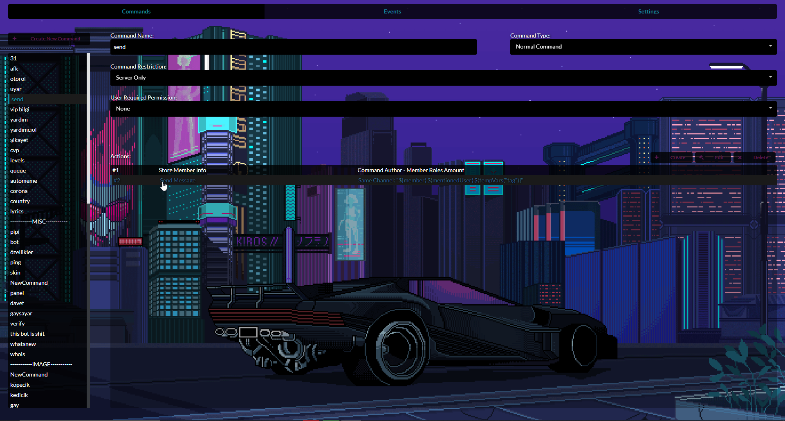
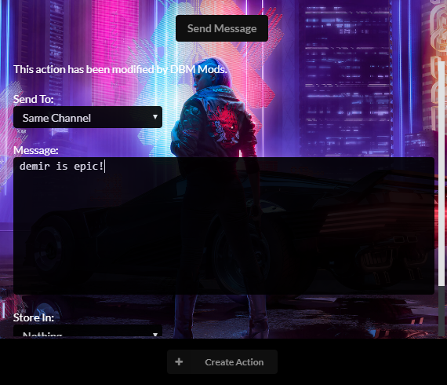

# CyberPunk DBM

+ Made by borgar#2819

+ I do not own any pictures or gifs in this theme.

+ Based off of the "Lo Fi Vibe" theme.

## Installation Guide
---------------------

1. Click Clone Or Download (but you won't have this option because you will be inside in this folder which won't let you clone or download (written by DemirK2#0001))
1. Press "Download Zip" (but you won't have this option because you will be inside in this folder which won't let you clone or download (written by DemirK2#0001) x2)
1. Open DBM
1. Click "Project"
1. Click "Open Theme Directory"
1. Open The themes-master.zip file. 
1. Unpack everything in to the themes folder.
1. Hover Over "Themes" In DBM then press "DBM CYBERPUNK" to Activate the Theme.

> Congrats! Now you are officialy using the theme DBM CYBERPUNK! Have fun developing.

 ## Support
borgar#2819, Demir2K#0001(dm = ban(if you're dm'ing Demir)).
